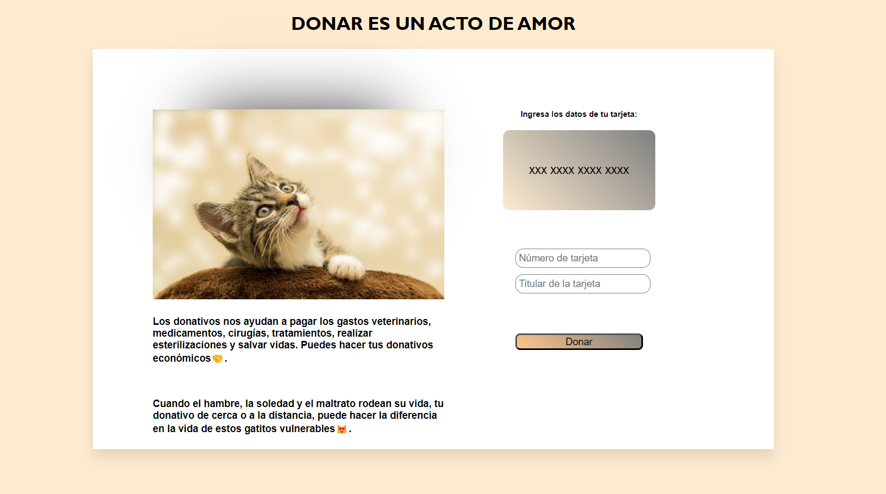

## Card Validation💳

**Descripción🐱**
+ Este proyecto es un validador de tarjetas que utiliza el algoritmo de Luhn, por lo que a través de nuestra aplicacion puedes hacer una donación para mejorar la vida de los gatos en todo el mundo

**Funcionalidades💁🏼‍♀️**
+ Inserta los número de tu tarjeta
+ Presiona el botón "Donar" para realizar tu donacion
- Este validador solo muestra los últimos cuatro dígitos por razones de seguridad
- No esta permitido ingresar campos vacios ni letras

**Decision de diseño📝**
+ Hemos optado por una interfaz de usuario intuitiva y amigable que permita a los usuarios ingresar sus datos de tarjeta y hacer sus donaciones de manera sencilla y rápida. Previniendo errores y fraudes

**Construido con:👩🏼‍💻**
+ [HTML]
+ [CSS]
+ [JAVASCRIPT]

**Créditos💅🏼**
+ Este proyecto fue creado por [Odett Pargas]✨.
Gracias por utilizar mi Validation, si tienes alguna pregunta o comentario sobre este proyecto, puedes contactarme.
